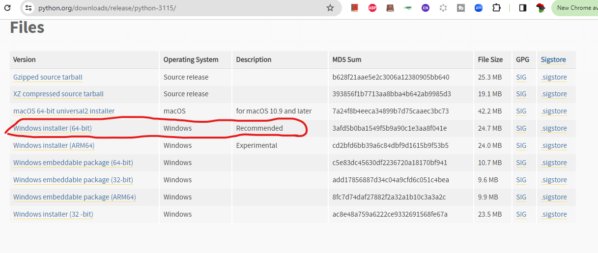
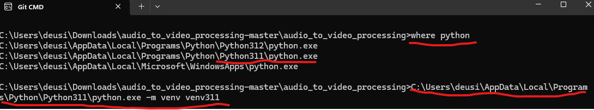
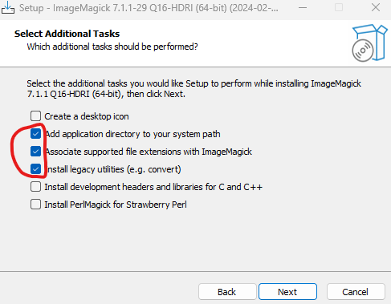

# Audio and Video Processing for Phrasebooks


This script is designed for processing the audio and producing videos for phrasebooks, particularly for the "Guide de conversation trilingue Français-anglais-fe'efe'e: French-Fè'éfě'è-English Phrasebook" series by Shck Tchamna [https://www.amazon.com/dp/B099TNLQL2, https://www.amazon.com/dp/B09B5DSVKL]. The books have been translated into multiple African languages, including Wolof, Duala, Ewondo, Swahili, Ewe, Kikongo, Yoruba, Igbo, Hausa, Fulfulde, and others. They consist of approximately 2044 sentences across 32 chapters, organized as follows:
"1-173": "Chap1",
"174-240": "Chap2",
"241-258": "Chap3",
...
"1965-1999": "Chap31",
"2000-2044": "Chap32"

Please note that this pipeline consists of multiple independent modules, each of which can be executed separately provided that the necessary resources (such as audio, text, images, and/or videos) are available for that particular module.

## Required Tools/Software:

- **Pillow 9.4.0**: Newer versions may not be compatible with the scripts.
- **Python 3.11**: I tested with Python 3.11.5: https://www.python.org/downloads/release/python-3115/. Newer versions may not be compatible with the scripts.
- **Install ImageMagick:** : ImageMagick-7.1.1-29-Q16-HDRI-x64-dll: https://imagemagick.org/script/download.php 
- **ffmpeg**: https://www.gyan.dev/ffmpeg/builds/



## 0. How to Setup the Environment

To prepare your environment for the project, follow these steps:

1. **Python Installation**: Ensure Python 3.11 is installed and correctly set up in your environment variables. This project specifically requires Python 3.11; other versions might not be compatible. 
   - To verify the installation path of Python 3.11, execute the command `where python` in your terminal. This command will display the full path to the Python executable. 
   - Utilize the identified path to establish your virtual environment for the project. For instance, if the path is `C:\Users\deusi\AppData\Local\Programs\Python\Python311\python.exe`, you can create a virtual environment named `venv311` by running the following command:
     ```
     C:\Users\deusi\AppData\Local\Programs\Python\Python311\python.exe -m venv venv311
     ```




1. **Create a New Environment**: Navigate to the **`Python_Scripts_Resulam_Phrasebooks_Audio_Processing`** directory and create a new virtual environment with the following command: **python -m venv venv_phrasebook**

2. **Activate the Environment**: Activate the newly created environment by running:
**venv_phrasebook\Scripts\activate**


1. **Install Requirements**: Install all required packages listed in `requirements_video_production.txt` within the activated environment:
**pip install -r requirements_video_production.txt**


6. **Create a Custom Kernel**: Set up a custom kernel for the virtual environment to use with Jupyter Notebooks:
**python -m ipykernel install --user --name=venv_phrasebook --display-name "venv phrasebook"**


7. **Launch Jupyter Notebook**: Start the Jupyter Notebook environment with the following command: **jupyter notebook**


8. **Select the Kernel**: In the Jupyter Notebook interface, select the kernel named **`venv phrasebook`** that you created for this project.

9. **Download and setup ffmpeg:** Go to the [ffmpeg builds page](https://www.gyan.dev/ffmpeg/builds/) and download the full build of ffmpeg, which is named **ffmpeg-git-full.7z**.

10. **Unzip the File and Extract It**: Navigate to the folder ending with `-full_build\bin`. Copy the content, create a directory called `ffmpeg` under `Program Files`, and paste all the content of the `bin` directory there. The path should look like `C:\Program Files\ffmpeg`.


11. **Install ImageMagick:**  Go to https://imagemagick.org/script/download.php download and install it.
    


By following these steps, your environment should be correctly set up to execute the project scripts.


## 1. Audio Processing (`2_AudioProcessing_Phrasebooks_Resulam.ipynb`)

The audio processing module aims to pad audio files with silence and merge bilingual audio tracks.

### 1.1. Pad Each Audio File

Optionally add silence between audio chunks to balance silence duration across all audio files. For instance, transforming (I am fine) + **0.5 second silence** + (thank you) into (I am fine) + **2 seconds silence**+ (thank you).

### 1.2. Audio Auto Merging

This feature merges audio files from a foreign language (e.g., English or French) with a local African language. For instance, `english_1.mp3` and `yoruba_1.mp3` would be merged to form `english_1_yoruba_1.mp3`. Likewise, `english_203.mp3` and `yoruba_203.mp3` would be merged to form `english_203_yoruba_203.mp3`

### 1.3. Required Folders

- **EnglishOnly**: Place English mp3 audio files here.
- **Phrasebook_Audio_Video_Processing_production_Backup/Languages**: Create subdirectories for each language here; e.g., **YorubaPhrasebook/YorubaOnly** for Yoruba audio files.
- For videos matching audios to sentences, create `Yoruba_english_french_phrasebook_sentences_list.txt` in **YorubaPhrasebook**, with sentences formatted as: `1) language1 | Language2 | Language3;` e.g., `1) Hello.| Ẹ ǹ lẹ́. | Salut.`
- - Notice that the language separator is |
- If you only want to display two languages in the Video, then only write 1) language1 | Language2; Example: 6)  I am fine.| Mo wà dáadáa.

### 1.4. Parameter Setup

- **local_language_name = 'yoruba'**: Specify the target local language.
- **silence_threshold = 1.5**: Chuncks separated by silence longer than this are considered distinct.
- **silence_padding_duration = 3**: Desired silence duration between audio chunks.
- **repeat_local_audio = 2**: Set to `2` to repeat the local language audio twice, or `1` if already repeated.
- **flag_pad = True**: Enable (`True`) or disable (`False`) extending silence between chunks.

### 1.5. Audio Processing Output

- **`\Languages\YorubaPhrasebook\YorubaOnly\padded_audio_dir`**: This directory contains the padded audio files. Padding involves adding silence between audio chunks to ensure consistency across all files.
- **`\Languages\YorubaPhrasebook\bilingual_sentences`**: This directory holds the bilingual audio files that have been merged from a foreign language (e.g., English or French) and a local African language.
- **`\Languages\YorubaPhrasebook\bilingual_sentences\bilingual_sentences_chapters`**: In this directory, the merged bilingual audio files are organized into chapters. Additionally, all the audio files within a chapter are combined into a single file named **1_CombineAudio**, which is also stored in this directory.


## 2. Video Producing (`3_Produce_video_from_text_and_audio.ipynb`)

This section is dedicated to producing videos from text and audio files processed in the previous step.


### 2.1. Additional Folders For Video Production

- **`\Ads_Images`**: This directory is for storing images intended for use as advertisements. An ad image will be shown after every 5 video frames. This frequency is adjustable in the notebook, by setting the parameter **change_background_frequency** of the function **build_videos_per_chapter**.
- **`\Backgrounds`**: Place all desired background images for videos here. The script uses these backgrounds sequentially in a cycle until all have been used, then starts over.

### 2.2. Main Parameters:
- **`local_language_name='yoruba'`**: Defines the local language for the video content.
- **`font_name_short = "CharisSIL-B.ttf"`**: Specifies the font used for text in the videos.
- **`logo_name = "resulam_logo_resurrectionLangue.png"`**: The name of the logo file to be used in the videos.

### 2.3. Key Features:

The video production script is designed to:
- Map the bilingual audio files created in the previous section to the text in the `english_french_phrasebook_sentences_list.txt` file.
- Automatically resize background images to 1980x1080 pixels.
- Randomly select a background from the `\Backgrounds` folder for use in videos.
- Automatically adjust text size to occupy half of the video screen.
- Use the other half of the screen to display ad images.
- Position the logo at the bottom left and right corners of the screen.
- Produce one video per sentence from the phrasebook.
- Organize videos by chapter, saving each in its respective Chapter Folder.
- Allow customization of the starting sentence for video production via the `start_build_num` variable.
- Among many other thing


[Amazon link to the book series](https://www.amazon.com/dp/B099TNLQL2)

## 3. Video Chunks Processor (`4_Combine_Videos_in_Chunks.ipynb`)


This Python script processes video files stored in chapter directories by grouping them into chunks, inserting an advertisement at a specified position within each chunk, and outputting the combined videos.

## Features

- **Naturally Sorts Videos**: Video files are sorted naturally to maintain logical order.
- **Handles Special Cases**: Videos prefixed with "no_" are specially handled to maintain their relative order.
- **Advertisement Insertion**: An advertisement video is inserted at a specified position within each chunk of videos.
- **Customizable Chunk Size**: The number of videos in each chunk and the position of the advertisement within the chunk can be easily adjusted.

## Dependencies

- **moviepy**: For video processing tasks such as concatenation.
- **natsort**: For natural sorting of video filenames.
- **os & random**: For file system navigation and random selection of advertisement videos.

## How to Use

1. **Set Up Your Environment**: Ensure Python is installed on your system and install the required packages using pip:

    ```sh
    pip install moviepy natsort
    ```

2. **Organize Your Videos**: Place your video files in chapter directories within a main directory. Name your video files in a way that reflects their desired order.

3. **Prepare Advertisement Videos**: Place your advertisement videos in a separate directory. The script will randomly select an advertisement for each chunk.

4. **Customize the Script**: Adjust the `ads_dir` and `chapters_dir` variables in the script to point to your directories. Set `chunk_size` and `ad_position` as needed.

5. **Run the Script**: Execute the script. It will process each chapter directory, combine videos into chunks, insert advertisements, and output the combined videos.

## Code Structure

- **process_chunk Function**: Takes a chunk of videos, combines them, inserts an advertisement, and outputs the result.
- **Main Loop**: Iterates through each chapter directory, sorts videos, processes them in chunks, and handles special cases.

## Output

The combined videos are saved in the same directory as the chapter directories, named according to the chapter and chunk number.

## Note

This script is designed for specific use cases and might need adjustments to fit your exact requirements.


